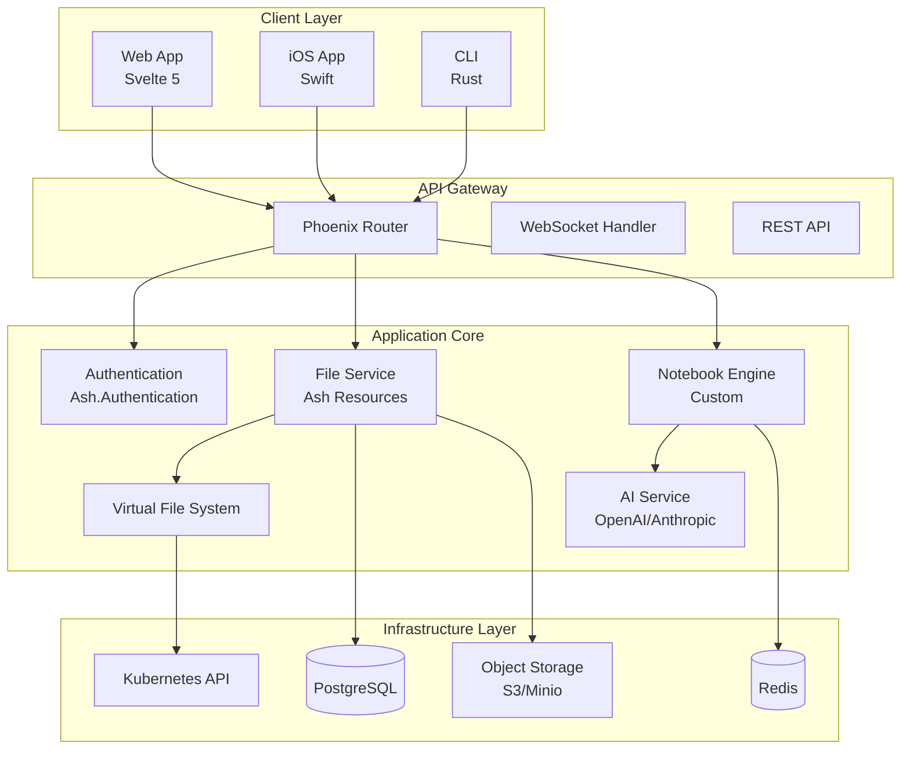

# Kyozo Platform Architecture

<!--
{
  "@context": {
    "@vocab": "https://kyozo.dev/vocab/",
    "schema": "https://schema.org/",
    "dc": "http://purl.org/dc/terms/",
    "foaf": "http://xmlns.com/foaf/0.1/"
  },
  "@type": "kyozo:TechnicalSpecification",
  "@id": "https://kyozo.app/docs/platform-architecture",
  "name": "Kyozo Platform Architecture Specification",
  "description": "Comprehensive technical architecture for the Kyozo development platform",
  "version": "1.0.0",
  "dateCreated": "2024-12-20",
  "dateModified": "2024-12-20",
  "author": {
    "@type": "schema:Organization",
    "name": "Kyozo Team",
    "url": "https://kyozo.app"
  },
  "audience": {
    "@type": "schema:Audience",
    "audienceType": "Developers",
    "name": "Platform Engineers"
  },
  "keywords": ["architecture", "elixir", "phoenix", "kubernetes", "cloud-native"],
  "programmingLanguage": ["Elixir", "TypeScript", "Swift", "SQL"],
  "softwareRequirements": {
    "@type": "schema:SoftwareApplication",
    "name": "Elixir",
    "softwareVersion": "1.15+"
  }
}
-->

## Executive Summary

<!--
{
  "@type": "kyozo:Section",
  "@id": "#executive-summary",
  "name": "Executive Summary",
  "position": 1,
  "abstract": "Kyozo is a cloud-native development platform that combines the power of markdown, notebooks, and infrastructure-as-code into a unified experience."
}
-->

Kyozo reimagines the development workflow by treating documentation as first-class infrastructure. Every markdown file can become an executable notebook, every notebook can deploy infrastructure, and every piece of infrastructure generates its own documentation.

### Core Philosophy

<!--
{
  "@type": "kyozo:DesignPrinciple",
  "name": "Documentation-Driven Development",
  "principles": [
    "Everything is Markdown",
    "Markdown can be executable",
    "Execution generates infrastructure",
    "Infrastructure generates documentation"
  ]
}
-->

1. **Everything is Markdown** - All documentation, specifications, and runbooks are markdown files
2. **Progressive Enhancement** - Markdown files gain capabilities through metadata and context
3. **Semantic Understanding** - JSON-LD provides machine-readable structure
4. **Unified Experience** - One platform for docs, code, and infrastructure

## System Architecture

<!--
{
  "@type": "kyozo:SystemDiagram",
  "@id": "#system-architecture",
  "name": "High-Level System Architecture",
  "components": [
    {
      "@type": "kyozo:Component",
      "name": "Phoenix Application",
      "technology": "Elixir/Phoenix",
      "responsibilities": ["API", "WebSockets", "Business Logic"]
    },
    {
      "@type": "kyozo:Component", 
      "name": "PostgreSQL",
      "technology": "PostgreSQL 15",
      "responsibilities": ["Data Persistence", "Full-text Search"]
    },
    {
      "@type": "kyozo:Component",
      "name": "Container Orchestrator",
      "technology": "Kubernetes",
      "responsibilities": ["Service Deployment", "Scaling", "Health Monitoring"]
    }
  ]
}
-->



## Core Components

<!--
{
  "@type": "kyozo:ComponentSpecification",
  "@id": "#core-components",
  "hasPart": [
    "#markdown-ld-engine",
    "#notebook-execution",
    "#virtual-file-system",
    "#ai-integration"
  ]
}
-->

### Markdown-LD Engine

<!--
{
  "@type": "kyozo:CodeModule",
  "@id": "#markdown-ld-engine",
  "name": "Markdown-LD Processing Engine",
  "programmingLanguage": "Elixir",
  "codeRepository": "lib/kyozo/markdown_ld.ex"
}
-->

```elixir
defmodule Kyozo.MarkdownLD.Engine do
  @moduledoc """
  Core engine for processing Markdown-LD documents.
  
  Responsibilities:
  - Parse markdown with embedded JSON-LD
  - Build semantic graph from content
  - Enable querying via SPARQL
  - Support executable blocks
  """
  
  use GenServer
  
  # Client API
  
  def process_document(content, opts \\ []) do
    with {:ok, doc} <- MarkdownLD.parse(content),
         {:ok, enriched} <- enrich_with_context(doc),
         {:ok, validated} <- validate_semantics(enriched) do
      
      # Store in graph database
      :ok = GraphDB.insert(validated.graph)
      
      # Index for search
      :ok = Search.index_document(validated)
      
      # Create notebook if executable
      if has_executable_content?(validated) do
        {:ok, _notebook} = create_notebook(validated)
      end
      
      {:ok, validated}
    end
  end
  
  # Server callbacks
  
  def init(opts) do
    state = %{
      cache: LRU.new(1000),
      stats: %{processed: 0, errors: 0}
    }
    {:ok, state}
  end
  
  def handle_call({:process, content}, _from, state) do
    case process_document(content) do
      {:ok, doc} ->
        new_state = update_stats(state, :success)
        {:reply, {:ok, doc}, new_state}
        
      {:error, reason} ->
        new_state = update_stats(state, :error)
        {:reply, {:error, reason}, new_state}
    end
  end
end
```

### Notebook Execution Engine

<!--
{
  "@type": "kyozo:ExecutionEnvironment",
  "@id": "#notebook-execution",
  "name": "Polyglot Notebook Execution",
  "supports": ["Elixir", "Python", "JavaScript", "SQL", "Bash"],
  "features": ["Dependency Resolution", "State Management", "Output Streaming"]
}
-->

```elixir
defmodule Kyozo.Notebooks.Executor do
  @moduledoc """
  Executes notebook cells with multi-language support.
  
  Features:
  - Language detection from code blocks
  - Dependency graph resolution
  - Parallel execution where possible
  - State isolation between executions
  """
  
  defstruct [:id, :cells, :state, :outputs, :status]
  
  def execute_notebook(notebook, opts \\ []) do
    # Build execution plan from Markdown-LD metadata
    {:ok, plan} = build_execution_plan(notebook)
    
    # Initialize execution environment
    env = init_environment(notebook, opts)
    
    # Execute cells according to plan
    Stream.unfold({plan, env}, &execute_next/1)
    |> Stream.take_while(&(&1 != :done))
    |> Enum.to_list()
  end
  
  defp build_execution_plan(notebook) do
    # Extract dependencies from JSON-LD
    deps = extract_dependencies(notebook.metadata)
    
    # Topological sort for execution order
    {:ok, Toposort.sort(notebook.cells, deps)}
  end
  
  defp execute_cell(cell, env) do
    case cell.language do
      "elixir" -> ElixirExecutor.run(cell, env)
      "python" -> PythonExecutor.run(cell, env)
      "sql" -> SQLExecutor.run(cell, env)
      "bash" -> BashExecutor.run(cell, env)
      _ -> {:error, "Unsupported language: #{cell.language}"}
    end
  end
end
```

### Virtual File System

<!--
{
  "@type": "kyozo:SystemComponent",
  "@id": "#virtual-file-system",
  "name": "Virtual File System (VFS)",
  "description": "Generates context-aware documentation based on project structure",
  "generates": ["guide.md", "deploy.md", "architecture.md"]
}
-->

```elixir
defmodule Kyozo.VFS.Generator do
  @moduledoc """
  Generates virtual files based on workspace context.
  
  The VFS analyzes your project and creates helpful documentation
  that doesn't exist as physical files but appears seamlessly in
  the file browser.
  """
  
  @behaviour Kyozo.VFS.GeneratorBehaviour
  
  def generate(workspace, path) do
    with {:ok, analysis} <- analyze_workspace(workspace),
         {:ok, templates} <- select_templates(analysis),
         {:ok, content} <- render_templates(templates, analysis) do
      
      # Return virtual files with Markdown-LD metadata
      {:ok, [
        %VirtualFile{
          path: "guide.md",
          content: add_metadata(content.guide, :guide),
          generator: __MODULE__
        },
        %VirtualFile{
          path: "deploy.md", 
          content: add_metadata(content.deploy, :deployment),
          generator: __MODULE__
        }
      ]}
    end
  end
  
  defp add_metadata(content, type) do
    """
    <!--
    {
      "@context": "https://kyozo.dev/vocab/",
      "@type": "kyozo:VirtualDocument",
      "documentType": "#{type}",
      "generatedBy": "VFS",
      "generatedAt": "#{DateTime.utc_now()}",
      "virtual": true
    }
    -->
    
    #{content}
    """
  end
end
```

## Data Models

<!--
{
  "@type": "kyozo:DataModel",
  "@id": "#data-models",
  "name": "Core Data Models",
  "implementedIn": "PostgreSQL",
  "models": ["User", "Team", "Workspace", "File", "Notebook"]
}
-->

### File Model with Markdown-LD Support

```elixir
defmodule Kyozo.Workspaces.File do
  use Ash.Resource,
    data_layer: AshPostgres.DataLayer,
    extensions: [AshJsonApi.Resource]
    
  attributes do
    uuid_primary_key :id
    
    attribute :name, :string, allow_nil?: false
    attribute :file_path, :string, allow_nil?: false
    attribute :content_type, :string, default: "text/markdown"
    
    # Markdown-LD specific
    attribute :is_markdown_ld, :boolean, default: false
    attribute :json_ld_metadata, :map
    attribute :semantic_type, :string  # From @type
    attribute :semantic_graph, :map    # RDF triples
    
    # Execution support
    attribute :is_executable, :boolean, default: false
    attribute :has_notebook, :boolean, default: false
    
    timestamps()
  end
  
  relationships do
    belongs_to :workspace, Kyozo.Workspaces.Workspace
    has_one :notebook, Kyozo.Workspaces.Notebook
  end
  
  changes do
    # Automatically detect Markdown-LD
    change Kyozo.Workspaces.File.Changes.DetectMarkdownLD
    
    # Create notebook for executable Markdown-LD
    change Kyozo.Workspaces.File.Changes.AutoCreateNotebook
  end
end
```

## API Design

<!--
{
  "@type": "kyozo:APISpecification", 
  "@id": "#api-design",
  "name": "RESTful API Design",
  "conformsTo": "OpenAPI 3.0",
  "endpoints": [
    {
      "@type": "kyozo:Endpoint",
      "path": "/api/v1/files",
      "methods": ["GET", "POST", "PATCH", "DELETE"]
    },
    {
      "@type": "kyozo:Endpoint",
      "path": "/api/v1/notebooks",
      "methods": ["GET", "POST", "PATCH", "DELETE"]
    }
  ]
}
-->

### File Operations with Markdown-LD

```yaml
# OpenAPI 3.0 Specification
paths:
  /api/v1/teams/{team_id}/files:
    post:
      summary: Create a file (auto-detects Markdown-LD)
      requestBody:
        content:
          application/json:
            schema:
              type: object
              properties:
                name:
                  type: string
                  example: "data-pipeline.md"
                content:
                  type: string
                  example: |
                    <!--
                    {
                      "@context": "https://schema.org",
                      "@type": "Dataset",
                      "name": "Sales Pipeline"
                    }
                    -->
                    # Sales Data Pipeline
                    
                    ```python
                    import pandas as pd
                    df = pd.read_csv('sales.csv')
                    ```
      responses:
        201:
          description: File created
          content:
            application/json:
              schema:
                $ref: '#/components/schemas/File'
                properties:
                  is_markdown_ld:
                    type: boolean
                    example: true
                  notebook:
                    $ref: '#/components/schemas/Notebook'
                    description: Auto-created notebook for Markdown-LD
```

## Deployment Architecture

<!--
{
  "@type": "kyozo:DeploymentSpecification",
  "@id": "#deployment",
  "name": "Kubernetes Deployment Architecture",
  "platform": "Kubernetes",
  "components": ["Phoenix App", "PostgreSQL", "Redis", "Minio"]
}
-->

### Kubernetes Resources

```yaml
# Application Deployment
apiVersion: apps/v1
kind: Deployment
metadata:
  name: kyozo-app
  labels:
    app: kyozo
    component: backend
spec:
  replicas: 3
  selector:
    matchLabels:
      app: kyozo
      component: backend
  template:
    metadata:
      labels:
        app: kyozo
        component: backend
      annotations:
        # Markdown-LD metadata for infrastructure
        kyozo.dev/markdown-ld: |
          {
            "@context": "https://kyozo.dev/vocab/",
            "@type": "kyozo:Service",
            "name": "Kyozo Backend",
            "scaling": {
              "min": 3,
              "max": 20,
              "metric": "cpu"
            }
          }
    spec:
      containers:
      - name: kyozo
        image: kyozo/platform:latest
        ports:
        - containerPort: 4000
        env:
        - name: MARKDOWN_LD_ENABLED
          value: "true"
        - name: VFS_ENABLED
          value: "true"
```

## Development Workflow

<!--
{
  "@type": "kyozo:Workflow",
  "@id": "#development-workflow",
  "name": "Markdown-LD Development Workflow",
  "steps": [
    "Write Markdown with JSON-LD",
    "System detects and parses metadata",
    "Automatic notebook creation",
    "Execute code blocks",
    "Deploy infrastructure"
  ]
}
-->

### Example: Creating a Data Analysis Document

```bash
# 1. Create a Markdown-LD file
cat > analysis.md << 'EOF'
<!--
{
  "@context": "https://schema.org",
  "@type": "Dataset",
  "name": "Q4 Sales Analysis",
  "creator": {"@type": "Person", "name": "Data Team"},
  "programmingLanguage": ["Python", "SQL"]
}
-->

# Q4 Sales Analysis

## Load Data

```python
import pandas as pd
import matplotlib.pyplot as plt

df = pd.read_sql("""
  SELECT date, channel, revenue
  FROM sales
  WHERE date >= '2024-10-01'
""", connection)

print(f"Loaded {len(df)} records")
```

## Visualize

```python
plt.figure(figsize=(10, 6))
df.groupby('channel')['revenue'].sum().plot(kind='bar')
plt.title('Q4 Revenue by Channel')
plt.show()
```
EOF

# 2. Upload via API - automatically creates notebook
curl -X POST https://api.kyozo.app/v1/files \
  -H "Authorization: Bearer $TOKEN" \
  -H "Content-Type: application/json" \
  -d @- << EOF
{
  "name": "analysis.md",
  "content": "$(cat analysis.md | jq -Rs .)"
}
EOF

# Response includes auto-created notebook
{
  "data": {
    "id": "file-123",
    "name": "analysis.md",
    "is_markdown_ld": true,
    "semantic_type": "Dataset",
    "notebook": {
      "id": "notebook-456",
      "status": "ready",
      "extracted_tasks": 2
    }
  }
}

# 3. Execute the notebook
curl -X POST https://api.kyozo.app/v1/notebooks/notebook-456/execute \
  -H "Authorization: Bearer $TOKEN"
```

## Security & Performance

<!--
{
  "@type": "kyozo:SecuritySpecification",
  "@id": "#security",
  "name": "Security Architecture",
  "measures": [
    "Zero-trust networking",
    "End-to-end encryption",
    "RBAC with fine-grained permissions",
    "Audit logging"
  ]
}
-->

### Security Layers

```elixir
defmodule Kyozo.Security do
  @moduledoc """
  Multi-layer security for Markdown-LD documents.
  
  Layers:
  1. Authentication - JWT/OAuth2
  2. Authorization - Policy-based (Ash.Policy)
  3. Encryption - At-rest and in-transit
  4. Sandboxing - Isolated execution environments
  """
  
  def authorize_markdown_ld(user, file, action) do
    with :ok <- check_authentication(user),
         :ok <- check_file_permissions(user, file, action),
         :ok <- check_semantic_permissions(user, file),
         :ok <- check_execution_permissions(user, file) do
      :ok
    end
  end
  
  defp check_semantic_permissions(user, file) do
    # Check permissions based on @type
    case file.semantic_type do
      "kyozo:ConfidentialDocument" ->
        Permissions.check(user, :view_confidential)
      
      "kyozo:ExecutableDocument" ->
        Permissions.check(user, :execute_code)
        
      _ ->
        :ok
    end
  end
end
```

## Future Roadmap

<!--
{
  "@type": "kyozo:Roadmap",
  "@id": "#roadmap",
  "name": "Platform Evolution Roadmap",
  "milestones": [
    {
      "@type": "kyozo:Milestone",
      "name": "v2.0 - AI-Native",
      "date": "2025-Q2",
      "features": ["AI code generation", "Semantic search", "Auto-documentation"]
    },
    {
      "@type": "kyozo:Milestone", 
      "name": "v3.0 - Federation",
      "date": "2025-Q4",
      "features": ["Cross-org sharing", "Distributed execution", "Global knowledge graph"]
    }
  ]
}
-->

### v2.0 - AI-Native Platform (Q2 2025)

- **AI-Powered Documentation**: Generate Markdown-LD from code
- **Semantic Search**: Query across all documents using SPARQL
- **Intelligent Suggestions**: Context-aware code completion
- **Auto-Documentation**: Generate docs from infrastructure

### v3.0 - Federated Knowledge (Q4 2025)

- **Cross-Organization Sharing**: Share Markdown-LD documents
- **Distributed Execution**: Run notebooks across clusters
- **Global Knowledge Graph**: Connect organizational knowledge
- **Blockchain Verification**: Immutable document history

## Conclusion

<!--
{
  "@type": "kyozo:Conclusion",
  "@id": "#conclusion",
  "summary": "Kyozo represents a paradigm shift in how we think about documentation, code, and infrastructure.",
  "callToAction": {
    "@type": "kyozo:Action",
    "name": "Get Started",
    "url": "https://kyozo.app/signup"
  }
}
-->

Kyozo transforms the development experience by unifying documentation, code execution, and infrastructure deployment into a single, coherent platform. With Markdown-LD at its core, every document becomes a potential application, every application generates its own documentation, and knowledge flows seamlessly between human and machine consumers.

The future of development is semantic, executable, and beautifully documented. Welcome to Kyozo.

---

<!--
{
  "@type": "kyozo:DocumentMetadata",
  "license": "CC-BY-4.0",
  "version": "1.0.0",
  "lastModified": "2024-12-20T12:00:00Z",
  "permalink": "https://kyozo.app/docs/platform-architecture",
  "formats": ["markdown", "html", "pdf", "rdf"]
}
-->